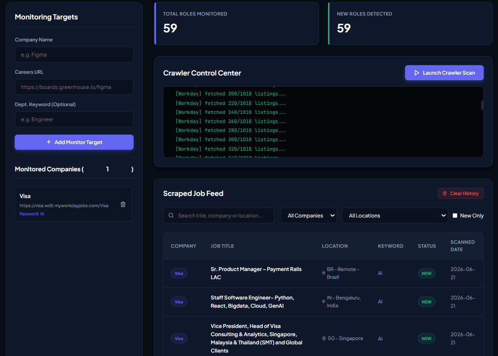

# <p align="center"></p>
# <p align="center">Job Automator & Tracker Portal</p>

<p align="center">
  <strong>An automated job board crawler and tracking portal that scans companies' careers pages, detects ATS systems, filters by keywords, and alerts you about new listings.</strong>
</p>

---

## 🚀 Overview

**Job Automator** is a lightweight, automated system designed to help you stay ahead of new job openings. By parsing careers portals (supporting modern ATS APIs and general web scraping fallbacks), it filters out irrelevant postings and highlights only the newest roles matching your specific criteria since the last run.

It comes equipped with both a **Command-Line Interface (CLI)** and a sleek, real-time **Flask Dashboard** that lets you add monitoring targets, launch scans, and view a live-updated job feed.

---

## 🎨 Dashboard Preview



---

## ✨ Features

- **🤖 Automated ATS Platform Detection**: Automatically detects the Applicant Tracking System (ATS) used by the target careers page (e.g., **Greenhouse**, **Lever**, **Workday**, **Ashby**, **SmartRecruiters**, or a custom platform).
- **🔌 API-First Scraping**: Utilizes official or public API endpoints for Greenhouse, Lever, and Workday to fetch job data reliably and fast, falling back to clean HTML parsing (`BeautifulSoup4` + `lxml`) for custom/unsupported boards.
- **🔍 Smart Keyword Filtering**: Focuses only on roles you care about (e.g., *Engineer*, *Product Manager*, *AI*) by matching titles against specified keywords.
- **🔄 State Persistence & Diffing**: Compares current crawls against previously saved jobs in `seen_jobs.json` to highlight new postings with a **`NEW`** badge.
- **🖥️ Real-time Web Portal**: A beautiful dark-themed dashboard built with Flask and HTML/CSS featuring:
  - Dynamic target company management (saved in LocalStorage).
  - Background crawler control center.
  - Live log streaming console powered by **Server-Sent Events (SSE)**.
  - Job search, filter by company/location, and "New Only" toggles.
- **📊 Auto-Generated HTML Reports**: Generates detailed standalone HTML reports (`all_jobs_<date>.html` and `new_jobs_<date>.html`) on every run.

---

## 🛠️ Installation & Setup

### 1. Clone the repository
```bash
git clone <repository-url>
cd "Job Automator"
```

### 2. Set up a virtual environment (Recommended)
```bash
python -m venv venv
```

**Activate the virtual environment:**
- **Windows (PowerShell):**
  ```powershell
  .\venv\Scripts\Activate.ps1
  ```
- **Windows (CMD):**
  ```cmd
  .\venv\Scripts\activate.bat
  ```
- **macOS/Linux:**
  ```bash
  source venv/bin/activate
  ```

### 3. Install Dependencies
```bash
pip install -r requirements.txt
```

---

## 📖 Usage

You can run the Job Automator either as a command-line script or as a local web portal.

### 🌐 Web Portal Dashboard (Recommended)

To launch the web dashboard, run:
```bash
python app.py
```
Open your browser and navigate to **`http://127.0.0.1:5000`**. 

From the dashboard, you can:
1. Add target companies with their career board URLs and optional department keywords (e.g. `Figma`, `https://boards.greenhouse.io/figma`, `Engineer`).
2. Click **Launch Crawler Scan** to run the crawl in the background and watch logs in the console stream in real-time.
3. Search and filter the aggregated jobs feed down below.

---

### 💻 Command-Line Interface (CLI)

The crawler can also be run directly from the console using a CSV input file.

#### 1. Configure Target List (`companies.csv`)
Create a file named `companies.csv` in the root directory with the following structure:
```csv
company,careers_url,department_keyword
Visa,https://visa.wd5.myworkdayjobs.com/Visa,AI
Figma,https://boards.greenhouse.io/figma,Engineer
```

#### 2. Run the Crawler
```bash
python runner.py
```

By default, the script reads `companies.csv` and outputs:
- `all_jobs_<date>.html` — HTML page containing all filtered job openings found.
- `new_jobs_<date>.html` — HTML page displaying only the newly detected roles.
- Updates/Creates `jobs_db.json` and `seen_jobs.json`.

You can also specify a custom CSV file:
```bash
python runner.py --input custom_companies.csv
```

---

## 📂 Project Structure

```
├── assets/                  # Images and graphics (Logo & previews)
│   ├── logo.png
│   └── dashboard_preview.png
├── templates/
│   └── index.html           # Main frontend portal HTML/JS/CSS
├── app.py                   # Flask server backend & SSE logging server
├── runner.py                # Core crawler logic & HTML report generator
├── requirements.txt         # Project python dependencies
├── companies.csv            # Default CLI target list
├── jobs_db.json             # Consolidated local database of scraped jobs
└── seen_jobs.json           # Crawling state persistence (for new job diffs)
```
